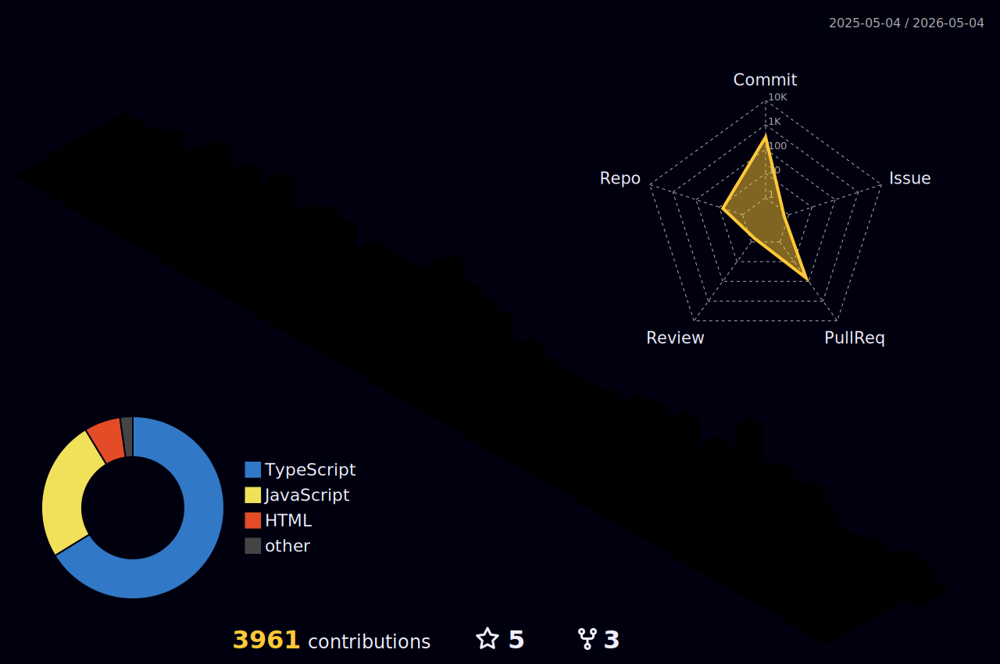

<!-- Header com animação -->
 

<!-- Apresentação -->

## 👩‍💻 Sobre mim

<table>
  <tr>
    <td>

- 💻 Desenvolvedora Web Full Stack com foco atual em Front-end  
- 🎓 Cursando Sistemas de Informação (UniFavip)  
- 🧠 Apaixonada por tecnologia, design e aprendizado contínuo  
- 🌐 Desenvolvendo projetos reais com React, Next.js e TypeScript  
- 🎯 Meta atual: dominar Python e Vue.js  
    </td>
    
    <td>
      
    </td>
  </tr>
</table>

##

  
  
  

## 🌐 Confira meu site portfólio:
👉 [https://andresa-alves.vercel.app/](https://andresa-alves.vercel.app/)

---

## 🛠 Tecnologias e Ferramentas

### Linguagens & Frameworks

### Estilo

### Ferramentas

### Sistemas Operacionais

---

## 💡 Quero aprender

---

## 📊 GitHub Stats

  
  
  

<!-- Snake -->

<!-- Footer -->

